# bamazon

<h1> Intro </h1>
The following instructions will guide you throught the necessary steps to running Bamazon on your local computer

<tr>
<li>First you must have mySQL installed on your computer in order to create the database and table. </li>

<li> Second You will need to install all the npm packages in the JSON file.</li>

<li> You will need to run the bamazonCustomer.sql file in a mySQL UI, and run the contents of it in the mySQL terminal </li>

<h1>Photo Examples Below:</h1>

Navigate to the appropriate directory, and "npm init" (initialize npm and create JSON files), then install the npm packages using command line.

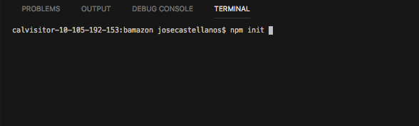 

Navigate to the appropriate directory and "npm i" (install) all the packages in the JSON file.

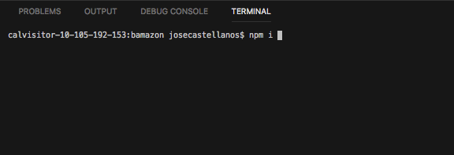 

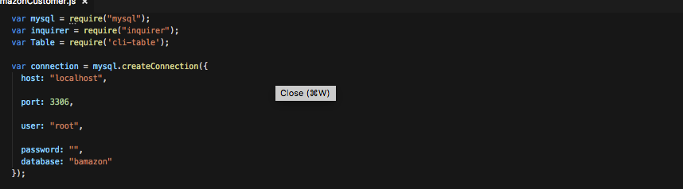  

 Upload all of are data to the database that we need to create on the mysql terminal on your computer

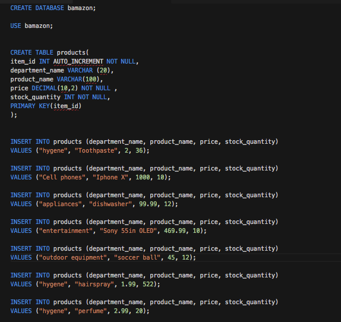 

 Now we can run this on node

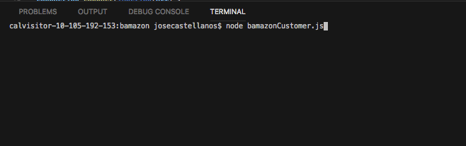 

Here are the three starting options given at the beginning of the bamazon application which are BUY,ADD, or CHECH INVENTORY 

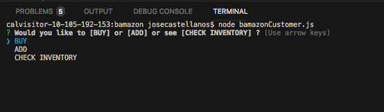 

 When the "CHECK INVENTORY" option is selected we see all the items in our current inventory

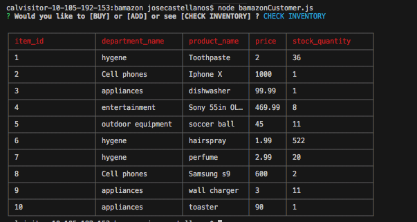 

Here is an example of the process that happens when we add a product to the inventory.

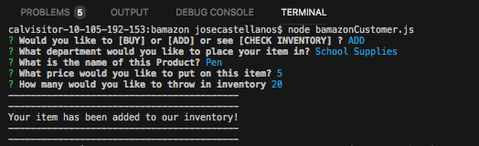 

We can also buy items on here and the processes is shown in the 2 photos below

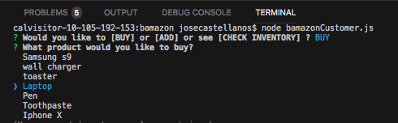 

We get a console.log saying how many of the items you have purchased

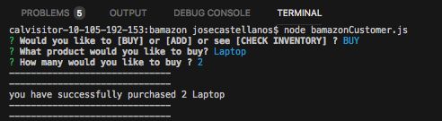 

You can check the inventory and see now that it has been updated. Since we started with 10 laptop and now there are only 8

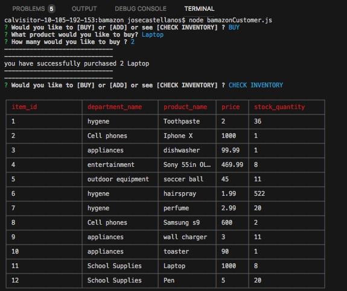  

<h1>Technologies Used</h1>
<li>Node.js</li>
<li>MySQL</li>
<li>Javascript</li>

<h1>Authors</h1> 
Jose Castellanos - 
<a href="http://github.com/jose408510">Jose Castellanos</a>